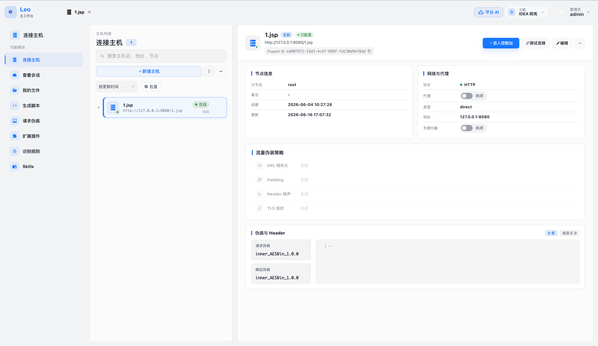

[English](README_EN.md) | **中文**

<div align="center">


# LeoAI

**AI 驱动的后渗透综合管理平台** 

[](LICENSE)
[](https://openjdk.org/)
[](https://spring.io/projects/spring-boot)
[](https://github.com/langchain4j/langchain4j)

LeoAI 是一款专为红队操作人员设计的后渗透管理工具，深度集成大语言模型（LLM）Agent 能力，实现智能化、自动化的后渗透操作流程。相比传统 WebShell 管理工具，LeoAI 提供 AI 辅助决策、多协议通信、流量伪装、团队协作等企业级能力，内置 Web 管理界面，开箱即用。



*节点管理主界面：节点列表、详情面板、流量伪装策略配置*

</div>

---

## 目录

- [功能特性](#功能特性)
- [技术栈](#技术栈)
- [环境要求](#环境要求)
- [快速开始](#快速开始)
- [配置说明](#配置说明)
- [使用指南](#使用指南)
- [常见问题](#常见问题)
- [安全建议](#安全建议)
- [免责声明](#免责声明)
- [License](#license)

---

## 功能特性

### AI 与智能化

| 功能 | 描述 |
|------|------|
| **AI Agent 自动化** | 基于 LangChain4j，支持多轮工具调用，自动规划和执行后渗透操作 |
| **多模型支持** | 兼容 OpenAI、Anthropic、通义千问、DeepSeek 及任何 OpenAI 兼容 API |
| **175 个 AI Tools** | AI Agent 可调用的原子能力，涵盖文件、进程、网络、凭据、扫描、HTTP 发包等全场景 |
| **24 个内置 AI Skills** | 预置的场景化任务提示词，一键启动完整攻击链（详见下方 Skills 列表） |
| **Skill 管理器** | 可视化管理 Skills：查看/编辑内容与描述、标签分类、启用/禁用、全文搜索，修改实时生效无需重启 |
| **上下文积累** | 侦察摘要自动积累，AI 上下文随操作深入持续增强 |
| **操作报告生成** | AI 自动生成操作总结和风险分析报告 |


*AI 助手自动调用侦察工具、分析结果并生成侦察摘要*

### 节点管理

| 功能 | 描述 |
|------|------|
| **多协议通信** | HTTP、HTTP Chunked（大文件传输）、WebSocket（实时交互） |
| **流量隐蔽** | TLS 指纹伪装、Header 噪声注入、URL 随机化、请求/响应自定义编码 |
| **代理转发** | 支持 HTTP 代理、SOCKS5 代理、本地端口转发（ssh -L 风格）、反向隧道（ssh -R 风格） |
| **团队协作** | 节点可在团队成员间共享，权限可控 |
| **批量节点管理** | 支持节点分组、标签管理、批量操作 |

### 操作控制台工具集

#### 交互与命令执行
- **Web 终端**：交互式 Shell，支持命令补全、历史记录、实时流输出
- **后台任务**：异步执行长时间命令，支持输出轮询和任务取消

#### 文件与存储
- **文件管理器**：树形目录浏览、上传/下载、在线编辑、压缩/解压、预览（文本/图片/PDF）、大文件分片传输
- **用户文件空间**：每个用户独立的本地文件存储区域

#### 数据库与信息系统
- **数据库控制台**：支持 MySQL、PostgreSQL、Oracle、SQLite、SQL Server，提供 SQL 编辑器和表结构浏览
- **注册表管理**（Windows）：浏览和修改注册表键值
- **事件日志查看**：查询 Windows 系统事件日志
- **防火墙管理**：查看和修改防火墙规则

#### 网络与扫描
- **端口扫描**：TCP 端口扫描、主机存活探测（Ping Sweep）
- **指纹识别**：HTTP/TCP 服务指纹识别，内置规则库，支持自定义规则
- **侦察扫描**：多目标、多规则并发侦察，结果自动汇总至 AI 上下文
- **HTTP 发包器**：Repeater（单次发包）和 Fuzzer（批量模糊测试）
- **代理转发**：在目标节点上开启 HTTP 代理、SOCKS5 代理、本地端口转发（ssh -L）或反向隧道（ssh -R），支持连接数统计与流量监控

#### 系统管理
- **截屏**：实时获取目标桌面截图
- **进程管理**：列出、杀死、创建进程
- **计划任务**：Windows 计划任务管理
- **服务管理**：启动、停止、重启 Windows 服务
- **Docker 管理**：列出、启动、停止、查看容器和镜像
- **应用管理**：Catalina 应用（Tomcat/WebLogic）、Spring Framework 运行时管理

#### 安全与权限
- **凭据提取**：系统凭据、浏览器数据、WiFi 配置
- **SUID/Capability 检查**：快速发现 Linux 提权点
- **用户账户管理**：目标主机用户枚举和操作
- **网络连接查看**：查看活跃连接、网络共享、已安装软件

#### 其他工具
- **类字节码查看**：提取并反编译 JVM 中的已加载类
- **剪贴板读取**：获取目标系统剪贴板内容
- **磁盘挂载管理**：查看和管理磁盘挂载点
- **HostId 切换**：单节点可管理多个内网主机


*操作控制台：基础信息总览、AI 技能快捷面板与对话区*

### Shell 生成器

#### 内存马生成
- 支持类型：Filter、Servlet、Listener、Valve、Interceptor、WebSocket
- 支持中间件：Tomcat、Jetty、JBoss、JBossAS、JBossEAP6、JBossEAP7、Wildfly、Undertow、Resin、Glassfish、Payara、WebLogic、WebSphere、SpringWebMVC、Apusic、BES、InforSuite、TongWeb、Struct2（共 19 种）
- 表达式注入 Packer：OGNL、SpEL、EL、Groovy、Freemarker、MVEL、BeanShell、Velocity、Thymeleaf、JEXL、Jinjava、JXPath、Rhino、Aviator、ScriptEngine、BCEL、Translet、XmlDecoder、H2、Base64、Hex 等（共 23 种）

#### WebShell 生成
- 支持格式：JSP、JSPX

### 指纹与识别规则

- **内置规则库**：预置 38 条常见服务的 HTTP/TCP 指纹识别规则（Nginx、Tomcat、Jenkins、Nacos、Redis、MySQL、Elasticsearch、GitLab 等）
- **自定义规则**：通过「**识别规则**」页面新增、编辑、启用/禁用指纹规则
- **规则标签**：支持协议过滤和标签分组，便于在扫描时按需筛选

### 插件系统

- **Java 插件热加载**：动态加载和执行自定义 Java 插件
- **内置插件**：脚本执行、命令执行、WebLogic 密码获取、堆转储分析
- **可扩展**：支持开发和集成自定义功能插件

### 管理功能

| 功能 | 描述 |
|------|------|
| **用户管理** | 创建用户、角色分配、权限控制 |
| **团队管理** | 创建团队、成员邀请、节点共享 |
| **AI 配置** | 多 LLM 通道配置、模型切换、API Key 管理 |
| **审计日志** | 操作审计（命令执行、文件操作等）、AI 对话审计 |
| **会话管理** | 会话记录、结果导出、操作报告生成 |

---

## 技术栈

| 层级 | 技术选型 |
|------|--------|
| **Web 框架** | Spring Boot 3.5 |
| **AI 框架** | LangChain4j 1.16 |
| **LLM 支持** | OpenAI、Anthropic、通义千问、DeepSeek 及所有 OpenAI 兼容接口 |
| **数据库** | SQLite（内嵌，无需额外部署）|
| **ORM** | MyBatis 3 |
| **HTTP 客户端** | OkHttp 4 |
| **字节码操作** | Javassist 3.30 |
| **构建工具** | Maven（多模块）|
| **运行环境** | Java 17+ |

---

## 环境要求

| 项目 | 要求 |
|------|------|
| **Java 版本** | 17 或更高（JDK/JRE 均可） |
| **操作系统** | Linux、macOS、Windows |
| **内存** | 建议 4 GB 以上 |
| **磁盘** | 至少 500 MB 可用空间 |
| **浏览器** | Chrome、Firefox、Edge 等现代浏览器 |

> 无需单独安装数据库：内置 SQLite，首次启动自动初始化。  
> 无需额外部署前端：Web 界面已打包至 JAR 文件中。

---

## 快速开始

### 第一步：获取 JAR

从 [Releases](https://github.com/cha0upup/LeoAI/releases) 页面下载最新版本：

```
LeoAi-0.0.3.jar
```

### 第二步：启动

```bash
java -jar --add-opens java.base/java.lang=ALL-UNNAMED LeoAi-0.0.3.jar
```

> `--add-opens java.base/java.lang=ALL-UNNAMED` 参数**不可省略**，用于开放 Java 模块系统内部访问权限。

### 第三步：访问

浏览器打开：

```
http://localhost:8082
```

### 第四步：初始化

首次启动时，系统自动完成以下操作：

1. 初始化 SQLite 数据库（在运行目录下生成 `data.db`）
2. 创建默认管理员账户
3. 初始化基础配置

**初始账号密码**：`admin` / `54ikun`，首次登录后请立即修改密码。

---

### Docker 启动

如果你不想折腾 Java 环境，直接用 Docker 一条命令启动即可。镜像构建时会自动从 Release 页面下载 JAR，不需要在本机装 JDK/Maven，也不会编译源码。

#### 第一步：安装 Docker

| 系统 | 操作 |
|------|------|
| **Windows / macOS** | 下载 [Docker Desktop](https://www.docker.com/products/docker-desktop/) 并安装，启动后保持 Docker 桌面在后台运行 |
| **Linux** | 按 [官方文档](https://docs.docker.com/engine/install/) 安装 docker engine 和 docker compose 插件 |

安装完成后打开终端验证（任意目录均可）：

```bash
docker --version
docker compose version
```

只要能看到版本号即可。

> **提示**：以下命令不需要 `sudo` 时尽量不用。Linux 下若提示 `permission denied`，把当前用户加入 `docker` 组（`sudo usermod -aG docker $USER` 后重新登录），或者命令前加 `sudo`。

#### 第二步：获取项目代码

任选一种方式：

```bash
# 方式 A：使用 git（推荐，便于后续更新）
git clone https://github.com/cha0upup/LeoAI.git
cd LeoAI

# 方式 B：直接下载 ZIP
# 打开 https://github.com/cha0upup/LeoAI 点击 Code → Download ZIP
# 解压后在终端 cd 进解压目录
```

#### 第三步：一键启动

在项目根目录（能看到 `Dockerfile` 和 `docker-compose.yml` 的位置）执行：

```bash
docker compose up -d --build
```

参数说明：
- `up`：启动服务
- `-d`：后台运行（detached），关闭终端不会停止容器
- `--build`：首次启动或代码更新时构建镜像；之后日常启动可省略

首次启动需要拉取基础镜像 + 下载 JAR + 安装运行时依赖，**国内网络通常需要 3~10 分钟**。看到类似下面的输出就成功了：

```text
[+] Running 2/2
 ✔ Network leoai_default     Created
 ✔ Container leoai           Started
```

#### 第四步：访问 Web 界面

浏览器打开：

```text
http://localhost:8082
```

**初始账号密码**：`admin` / `54ikun`，首次登录后请立即修改密码。

#### 常用命令速查

```bash
# 查看运行状态
docker compose ps

# 查看实时日志（Ctrl+C 退出，容器继续运行）
docker compose logs -f

# 停止服务（保留数据）
docker compose stop

# 重新启动
docker compose start

# 完全停止并删除容器（保留数据 volume）
docker compose down

# 完全清理（含数据，⚠️ 不可恢复）
docker compose down -v

# 升级到最新版本（拉取新代码 + JAR 重新构建）
git pull
docker compose up -d --build
```

#### 数据持久化

SQLite 数据库和 VFS 运行目录都会保存在名为 `leoai-data` 的 Docker volume 里。容器删了重建数据不会丢，除非显式 `docker compose down -v`。

查看 volume 实际位置：

```bash
docker volume inspect leoai_leoai-data
```

#### 自定义配置

最简单的做法是在项目根目录新建 `.env` 文件，docker compose 会自动读取：

```bash
# 修改 Web 端口（避开 8082 被占用的情况）
LEOAI_PORT=9090

# 配置 OpenAI 或兼容接口
OPENAI_API_KEY=sk-xxxxx
OPENAI_BASE_URL=https://api.openai.com/v1
# 国内用户可换成兼容服务
# OPENAI_BASE_URL=https://api.deepseek.com
# OPENAI_BASE_URL=https://dashscope.aliyuncs.com/compatible-mode/v1

# 生产环境建议改成强随机字符串（至少 16 位）
LEO_PLUGIN_ENCRYPT_KEY=please-change-me-to-a-strong-key

# 锁定到特定版本的 JAR（默认会拉 V0.0.3）
# JAR_URL=https://github.com/cha0upup/LeoAI/releases/download/V0.0.3/LeoAi-0.0.3.jar
```

修改 `.env` 后用 `docker compose up -d` 让改动生效。**注意**：改 `JAR_URL` 必须加 `--build`，否则不会重新拉取。

也可以临时通过命令行覆盖（一次性，不持久）：

```bash
LEOAI_PORT=9090 OPENAI_API_KEY=sk-xxxxx docker compose up -d
```

#### 常见问题

**端口冲突 `Bind for 0.0.0.0:8082 failed: port is already allocated`**
- 在 `.env` 里改 `LEOAI_PORT=9090`（或任意空闲端口）后重新 `docker compose up -d`

**镜像构建卡在下载 JAR**
- 多半是 GitHub 网络不通。挂代理后重新 `docker compose build`，或先手动把 JAR 下载到本地，改 Dockerfile 的 `JAR_URL` 指向局域网镜像

**忘记 admin 密码**
- 执行 `docker compose down -v` 清除数据 volume（⚠️ 全部数据丢失），重新 `docker compose up -d --build` 即可用初始密码登录

**查看容器内文件**
- `docker compose exec leoai sh` 进入容器，数据目录在 `/app/data`

---

## 配置说明

### 修改端口

默认端口为 `8082`，通过启动参数修改：

```bash
java -jar --add-opens java.base/java.lang=ALL-UNNAMED \
  LeoAi-0.0.3.jar --server.port=9090
```

### 修改数据库位置

默认数据库文件为运行目录下的 `data.db`：

```bash
java -jar --add-opens java.base/java.lang=ALL-UNNAMED \
  LeoAi-0.0.3.jar \
  --spring.datasource.url=jdbc:sqlite:/path/to/data.db
```

### 配置 AI 模型

LeoAI 的 AI 功能需要接入 LLM 接口，支持两种配置方式：

#### 方式一：Web 界面配置（推荐）

1. 登录后进入「**管理后台 → AI 配置**」
2. 点击「**添加通道**」
3. 填写通道名称、API Key、Base URL、模型名称
4. 点击「**测试连接**」验证后保存

#### 方式二：环境变量

```bash
export OPENAI_API_KEY=your-api-key
export OPENAI_BASE_URL=https://api.openai.com/v1

java -jar --add-opens java.base/java.lang=ALL-UNNAMED LeoAi-0.0.3.jar
```

### 支持的 AI 模型

兼容任何遵循 OpenAI API 格式的服务：

| 提供商 | Base URL 示例 |
|--------|-----------|
| OpenAI | `https://api.openai.com/v1` |
| Anthropic | 通过 OpenAI 兼容代理（如 LiteLLM、One-API）接入 |
| 通义千问（阿里） | `https://dashscope.aliyuncs.com/compatible-mode/v1` |
| DeepSeek | `https://api.deepseek.com` |
| Ollama（本地） | `http://localhost:11434/v1` |
| 其他兼容接口 | 根据文档填写对应地址 |

### 主要配置项参考

`web/src/main/resources/application.properties`：

```properties
# 服务器端口
server.port=8082

# 数据库（SQLite，路径相对于运行目录）
spring.datasource.url=jdbc:sqlite:data.db

# AI 配置（也可通过 Web 界面管理）
leo.ai.openai.api-key=${OPENAI_API_KEY:}
leo.ai.openai.base-url=${OPENAI_BASE_URL:https://api.openai.com/v1}
leo.ai.openai.model=gpt-4o
leo.ai.openai.thinking-enabled=false
```

---

## 使用指南

### 添加节点

1. 登录后进入「**节点管理**」
2. 点击「**添加节点**」，填写：
   - **节点名称**：自定义标识
   - **目标 URL**：目标节点地址（如 `http://target.com/shell`）
   - **通信协议**：HTTP / HTTP Chunked / WebSocket
   - **访问密钥**：与 Shell 端保持一致
3. 按需配置流量伪装模板，保存

#### 协议选择参考

| 协议 | 适用场景 |
|------|---------|
| **HTTP** | 通用场景，防火墙穿透性最好 |
| **HTTP Chunked** | 大文件传输、长日志查询 |
| **WebSocket** | 终端交互等低延迟需求 |

### 操作控制台

进入节点后可使用各工具模块：

- **终端**：执行 Shell 命令，实时流式输出
- **文件管理**：树形浏览、上传下载、在线编辑、压缩解压、文件预览
- **数据库**：先在「系统配置 → 数据库配置」添加 JDBC 连接，再在控制台选择使用
- **端口扫描**：快速扫描 / 自定义端口范围 / 结果导出
- **HTTP 发包器**：Repeater 单次发包，Fuzzer 批量模糊测试

### 代理与隧道

在节点控制台的「**代理**」面板下可管理四种流量转发模式：

| 模式 | 说明 | 典型场景 |
|------|------|---------|
| **SOCKS5 代理** | 在节点上开 SOCKS5 监听，C2 通过它访问内网 | Proxychains / Burp 上游代理 |
| **HTTP 代理** | 同上，HTTP CONNECT 隧道，兼容性更好 | 浏览器手动代理 |
| **本地端口转发**（ssh -L） | C2 本地端口 → 节点 → 内网 host:port | 直连内网单服务（RDP、DB 等） |
| **反向隧道**（ssh -R） | 节点开监听 → 内网客户端主动连 → C2 拨号转发 | 让内网机器主动回连 payload 服务器 |

各模式均提供连接数、上传/下载流量统计面板，支持一键停止。

### Skill 管理器

进入主界面侧边栏「**Skills**」，可对两个 scope（puppet-node / platform）下的所有 Skills 进行可视化管理：

- **查看与编辑**：点击列表中的 Skill 可在右侧预览内容；切换到编辑模式后可修改正文和描述，保存后实时生效，无需重启
- **标签（Tags）**：每个 Skill 可附加多个标签（如 `recon`、`exploit`、`linux`），在列表和编辑模式中均可查看和修改；左侧提供标签筛选面板，可多选组合过滤
- **启用 / 禁用**：禁用的 Skill 不会出现在 AI 的 system prompt 中，AI 对其存在完全无感知；可按需关闭暂不使用的 Skill 以节省 token
- **全文搜索**：支持按 name、description 或正文内容模糊搜索
- **新建 / 删除**：可创建自定义 Skill，填写名称、描述后在编辑器中编写 Skill 提示词

Skill 文件存储在 VFS 目录下，格式为标准 Markdown + YAML frontmatter：

```markdown
---
name: recon-basic-info
description: 对目标主机执行初始基础信息侦察...
enabled: true
tags:
  - recon
  - linux
---

# Skill 正文内容
...
```

### AI 助手

**节点级 AI**：在操作控制台右侧打开 AI 对话面板，输入指令（如"扫描 C 类网段的 80 端口"），AI 自动调用工具完成操作，并持续积累侦察上下文。

控制台技能快捷面板提供 21 个预置 puppet-node Skills，可一键启动完整场景任务：

| 类别 | Skills |
|------|--------|
| **侦察** | `recon-basic-info`、`recon-internal-network`、`recon-active-directory`、`discover-web-apps`、`analyze-logs-intelligence` |
| **凭据收集** | `hunt-credentials`、`collect-spring-boot-config`、`collect-cloud-metadata`、`collect-kubernetes-secrets` |
| **权限提升** | `escalate-linux-privilege`、`escalate-windows-privilege` |
| **持久化** | `persistence-linux`、`persistence-windows` |
| **横向移动** | `lateral-move-ssh`、`lateral-move-wmi-psexec` |
| **漏洞利用** | `exploit-spring-actuator`、`exploit-nacos-post`、`exploit-redis-post`、`exploit-database-post`、`exploit-kerberos` |
| **容器/云** | `detect-container-escape` |

**平台级 AI**：全局 AI 助手，内置 3 个平台 Skills（`develop-disguise`、`develop-fingerprint`、`exploit-suggest`），可协助编写流量伪装模板、设计指纹规则，以及基于命中指纹生成漏洞利用建议。

### Shell 生成

1. 进入「**工具 → Shell 生成**」
2. 选择「**内存马**」或「**WebShell**」
3. 选择目标中间件类型和注入方式
4. 配置连接密钥，点击「**生成**」

### 流量伪装

> **伪装即密钥**：LeoAI 没有独立的连接密钥字段——管理端与 Shell 端使用完全相同的 encode/decode 逻辑通信，伪装不匹配则请求无法解析，连接自然失败。因此**强烈建议每位用户创建专属伪装**，不同项目使用不同伪装，避免共享内置模板。

1. 进入「**工具 → 流量伪装**」，系统内置 5 套伪装模板（ZIP 上传信封、JPEG 隐写、JSON 序列化包装、Multipart 上传、XML 信封），可作为参考或起点
2. 点击「**新增**」，编写自定义 `encodeBody` / `decodeBody` 逻辑，通过「**测试**」验证互逆后保存
3. 在 Shell 生成时选择同一个伪装，确保管理端和 Shell 端使用完全一致的编解码实现
4. 在节点配置中将「请求伪装」和「响应伪装」指向对应模板即可生效

### 团队协作

- 在「**管理后台 → 团队管理**」创建团队并邀请成员
- 在节点详情中点击「**分享**」，指定团队或成员及读写权限
- 所有操作记录在「**管理后台 → 审计日志**」，支持按用户/时间/类型筛选

---

## 常见问题

**Q：启动时报 `InaccessibleObjectException`**

必须添加 `--add-opens` 参数，不可省略：

```bash
java -jar --add-opens java.base/java.lang=ALL-UNNAMED LeoAi-0.0.3.jar
```

---

**Q：AI 功能无响应或报错**

1. 进入「管理后台 → AI 配置」检查通道配置
2. 点击「测试连接」验证 API Key 和 Base URL
3. 确认 API 配额和请求限制
4. 查看服务端日志获取详细错误信息

---

**Q：节点连接失败**

按以下顺序排查：

1. 确认目标 URL 可访问（curl 测试）
2. 确认通信协议与 Shell 实现一致
3. 确认节点密钥与 Shell 端配置一致
4. 若使用流量伪装，确认模板两端编解码逻辑匹配
5. 查看浏览器 Network 面板和服务端日志

---

**Q：如何重置管理员密码**

停止应用 → 删除（或备份）`data.db` → 重新启动 → 使用初始账号密码 `admin` / `54ikun` 登录。

---

**Q：支持 HTTPS 吗**

建议通过前置 Nginx / Apache 反向代理层配置 SSL，将 HTTPS 请求转发至 LeoAI。

---

**Q：data.db 文件在哪里**

默认在 JAR 的运行目录下，可通过启动参数指定自定义路径：

```bash
--spring.datasource.url=jdbc:sqlite:/custom/path/data.db
```

---

## 安全建议

**部署安全**

- 在受信任的内网或 VPN 环境中部署，不要将管理端口暴露至公网
- 首次启动后立即修改管理员密码
- 定期备份 `data.db` 文件
- 使用防火墙或 IP 白名单限制访问来源

**操作安全**

- 遵循最小权限原则，为不同成员分配必要的最小权限
- 不同项目使用不同团队账户进行隔离
- 妥善保管 LLM API Key，避免在日志或截图中泄露
- 在存在流量检测风险的环境中启用流量伪装功能
- **每位用户创建专属伪装**，不同项目使用不同伪装，避免共享内置模板——伪装即通信密钥，泄露即意味着通信可被模拟或解密

---

## 免责声明

**本工具仅供已获得明确书面授权的安全测试、红队攻防演练和安全研究使用。** 使用者须确保已取得目标系统所有者的合法授权。任何未经授权的访问、修改或破坏行为均属违法，开发者不对任何滥用或违法使用行为承担责任。使用本工具即表示你同意承担全部相关法律责任。

---

## License

本项目采用 [GNU General Public License v3.0](LICENSE) 许可证。

---

## 联系与反馈

- Issue：[GitHub Issues](https://github.com/cha0upup/LeoAI/issues)
- 邮件：chaodovvn@gmail.com
- 项目主页：[https://github.com/cha0upup/LeoAI](https://github.com/cha0upup/LeoAI)
